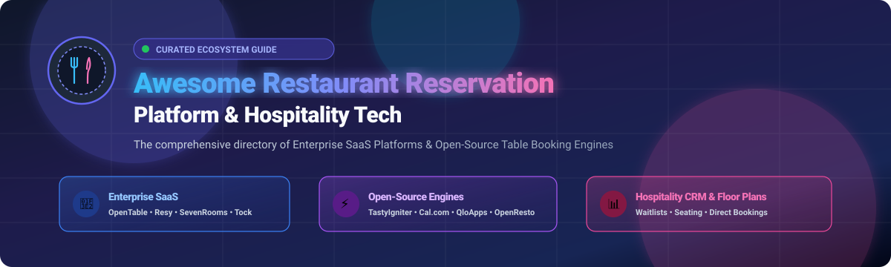

# 🍽️ Awesome Restaurant Reservation Platform

  
  
  
  
  

  

---

## 🌟 Top Restaurant Reservation Platforms Ecosystem
> **A Curated List of Leading SaaS Products & Open-Source GitHub Projects**  
> *Targeted at Online Table Booking, Guest Management CRM, Visual Floor Plans, Waitlists, Direct Bookings & Hospitality Operations.*  
> **📅 Last updated: August 2026**

This repository provides an authoritative, SEO-optimized guide tracking notable **Enterprise SaaS platforms** and **Open-Source projects** for modern **Restaurant Reservation Systems**. These technologies empower restaurants, hospitality groups, bars, and cafes to automate online table bookings, manage floor inventory in real-time, eliminate costly no-shows, maintain rich guest profiles (CRM), and tap into global diner discovery networks.

---

## 📑 Table of Contents
- [📊 Market Overview & Industry Structure](#-market-overview--industry-structure)
- [🏢 SaaS & Hosted Platforms](#-saashosted-platforms)
- [⚡ Open-Source GitHub Projects](#-open-source-github-projects)
- [🛠️ Key Architectural Patterns & Self-Hosting](#-key-architectural-patterns--self-hosting)
- [🤝 How to Contribute](#-how-to-contribute)
- [⭐ Star History](#-star-history)
- [📜 Disclaimer](#-disclaimer)

---

## 📊 Market Overview & Industry Structure

> **📈 Estimated Sector Market Size:** The global restaurant reservation software market is valued at **~$2.1 Billion** in 2025/2026 and is projected to surpass **$4.8 Billion by 2032**, expanding at a Compound Annual Growth Rate (CAGR) of **~11.5%**.  
> **🌐 Market Concentration & Fragmentation:** The sector is **moderately concentrated in core metropolitan regions (North America & Western Europe) and highly fragmented globally.** High-density markets demonstrate strong network effects driven by mega-ecosystems (OpenTable/Booking Holdings, Resy & Tock/American Express, SevenRooms, Yelp), while APAC, EMEA, and independent operators remain fragmented, driving explosive adoption of commission-free direct booking tools and self-hosted open-source software.

---

## 🏢 SaaS/Hosted Platforms

| Platform | Description & Focus | Company Size / Valuation | Starting Pricing | Free Tier / Trial Limits |
| :--- | :--- | :--- | :--- | :--- |
| **[Resy](https://resy.com/)** | Upscale-focused dining reservation and guest engagement platform known for prime-time inventory, notify waitlists, and Amex member benefits. | **$200B+ Parent Market Cap** (American Express; Acquired for ~$100M+) | **$249/month** (Platform tier; Essential at $269/mo, Platform 360 & Premium at $399/mo; flat rate, $0 per-cover fees) | No free-forever tier; No free trial (1-on-1 personalized sales demo only) |
| **[OpenTable](https://www.opentable.com/)** | The world's largest consumer dining network and front-of-house table management system, seating over 1.5B diners annually. | **$160B+ Parent Market Cap** (Booking Holdings - NASDAQ: BKNG; ~$350M+ ARR) | **$149/month** (Basic plan; Core at $299/mo, Pro at $499/mo) + $1.00–$1.50 per network cover ($0.25/direct cover) | No free-forever tier; No self-serve free trial (custom sales demo only) |
| **[Quandoo](https://www.quandoo.com/)** | International restaurant reservation marketplace connecting diners with European and APAC venues with table management tools. | **$60B+ Parent Market Cap** (Recruit Holdings - TYO: 6098; Acquired for $219M) | **€49/month** (~$53/mo) + €1.50–€2.50 per network cover *(Marketplace winding down by end of 2026)* | No free-forever tier; No active free trial available (sales inquiry only) |
| **[ResDiary](https://www.resdiary.com/)** | Commission-free online reservation, floor management, and table booking software widely adopted across the UK, Europe, and Australasia. | **$12B+ Parent Valuation** (The Access Group; Acquired in 2022) | **£89/month** (~$115/mo for Connect tier; Pro at £140/mo, Ultimate at £275/mo; flat fees) | No free-forever tier; No public free trial (guided product demo only) |
| **[Yelp Guest Manager](https://www.yelp.com/guestmanager)** | Front-of-house seating, waitlist management, and reservation software deeply integrated into Yelp search and consumer traffic. | **$2.5B+ Market Cap** (Yelp Inc. - NYSE: YELP; ~$1.3B Annual Revenue) | **$129/month** (Basic tier billed annually, or $159/mo month-to-month; Plus tier at $279/mo) | Basic tier capped at **500 seated covers/month**; No permanent free tier or self-serve trial (demo-assisted trial only) |
| **[Wisely](https://www.getwisely.com/)** | Enterprise restaurant CRM, waitlist management, guest intelligence, and customer lifetime value engine for multi-unit brands. | **$1B+ Parent Market Cap** (Olo Inc. - NYSE: OLO; Acquired for $187M in 2021) | **~$150/location/month** (Base CRM & waitlist module for multi-unit enterprise operators) | No free-forever tier; No self-serve free trial (enterprise walkthrough demo only) |
| **[SevenRooms](https://sevenrooms.com/)** | Hospitality guest experience platform emphasizing direct online reservations, automated CRM, POS integrations, and personalized dining. | **$500M+ Valuation** (~$130M Raised from Amazon Alexa Fund, PSG; ~$60M–$100M ARR) | **~$300/month** (Essentials tier; custom-quoted up to $700+/mo for Growth & Enterprise tiers) | No free-forever tier; No public free trial (personalized product demo only) |
| **[Tock](https://www.exploretock.com/)** | High-demand reservation, prepaid ticketing, and culinary event booking platform catering to fine-dining and tasting menus. | **$400M Valuation** (Acquired by Squarespace & Amex for $400M) | **$199/month** (Essential tier; Plus/Premium at $399–$459/mo) + 2%–3% processing fee on prepaid reservations/tickets | No free-forever tier; No self-serve free trial (custom demo only) |
| **[TableCheck](https://www.tablecheck.com/)** | Global multi-lingual reservation and guest management solution with strong adoption across Japan, Asia-Pacific, and luxury hotel chains. | **$50M–$100M Est. Valuation** (~$15M Raised Series B; 10,000+ active venues) | **¥150/user/month** (~$1.00/user/mo base) or ~**$100/month** base venue plan (commission-free direct bookings) | **30-day free trial** available upon request with sales onboarding (no permanent free-forever tier) |
| **[Eat App](https://restaurant.eatapp.co/)** | Flat-fee table management and reservation system focused on guest CRM, messaging automation, and direct zero-commission reservations. | **$25M–$50M Est. Valuation** (~$13M Raised Series B; thousands of venues in 140+ countries) | **$49/month** (Starter tier; Essential at $129/mo, Pro at $229/mo) | **Free-forever plan** capped at **100 covers/month** (excludes SMS automations); also offers a **14-day free trial** with full feature access |
| **[Hostme](https://www.hostmeapp.com/)** | Intuitive table management, online reservation widget, digital waitlist, and server rotation tool designed for independent eateries. | **~$10M–$20M Est. Valuation** (Independent SMB hospitality tech provider) | **$109/month** (Mezzo tier; Grande tier at $169/mo with POS integration) | **14-day free trial** (full access to core reservation & table management features, no credit card required; no permanent free-forever plan) |

---

## ⚡ Open-Source GitHub Projects

*Sorted in descending order by GitHub Star counts.*

1. **[Cal.com](https://github.com/calcom/cal.com)**   
   Enterprise-grade, open-source scheduling infrastructure and booking engine. Extensible via APIs and webhooks for table reservations, private dining slots, multi-venue booking calendars, and custom guest intake flows.

2. **[QloApps](https://github.com/Qloapps/QloApps)**   
   Open-source hospitality and property reservation management system (PMS + booking website engine) adaptable for restaurant table holds, VIP room bookings, and hospitality dining operations.

3. **[Easy!Appointments](https://github.com/alextselegidis/easyappointments)**   
   Highly extensible open-source web application for managing time slots, bookings, and customer notifications with Google Calendar synchronization and embeddable booking widgets.

4. **[TastyIgniter](https://github.com/tastyigniter/TastyIgniter)**   
   The leading open-source (MIT) online ordering, table reservation, and restaurant management platform built on Laravel (PHP). Supports interactive floor plans, multi-location dining, customer accounts, and kitchen management without per-cover fees.

5. **[LibreBooking](https://github.com/LibreBooking/librebooking)**   
   Free open-source resource and venue scheduling system supporting multi-table allocation, recurring dining bookings, user quotas, and waitlists.

6. **[OpenResto](https://github.com/karanshukla/openresto)**   
   Self-hosted booking management system for restaurants, bars, and cafes. Features real-time table holds, multi-restaurant support, floor sections, and a streamlined mobile-friendly booking UI.

7. **[Restaurant-Reservation-System](https://github.com/Brad-Galindo/Resturant-Reservation-System)**   
   Full-stack PERN (PostgreSQL, Express, React, Node.js) restaurant reservation and seating management system with real-time table assignment, search, and status tracking.

8. **[Restaurant Table Reservation System](https://github.com/slavyanHristov/restaurant-table-reservation-system)**   
   Vue.js and Node.js single-page application for managing dining reservations, availability status, guest party sizes, and seating schedules.

9. **[SeatKit](https://github.com/seatkit/seatkit)**   
   Open-source reservation and table allocation management system designed for high-turnover, small-seat venues with interactive visual table management and real-time staff collaboration.

10. **[Laravel Restaurant Reservation System](https://github.com/Mustafa21102005/restaurant-reservation-system)**   
    Modern Laravel-based table reservation portal with role-based admin dashboards, menu integration, table availability verification, and automated confirmation workflows.

---

## 🛠️ Key Architectural Patterns & Self-Hosting

Deploying self-hosted open-source software gives operators complete ownership of diner data and eliminates recurring cover charges:

- 🖥️ **Self-Hosted Booking Engine**: Host **TastyIgniter** or **OpenResto** on a cloud VPS (Docker, Kubernetes, or LAMP/LEMP stack) with full database control.
- 🔗 **Direct Website & POS Integration**: Embed widget forms into WordPress, Next.js, or Webflow sites and bridge guest check-ins with POS hardware.
- 📱 **SMS & Email Automations**: Connect open booking backends with Twilio, AWS SES, or SendGrid to send automatic SMS confirmations, reducing no-show rates.
- 📊 **Hospitality Data Warehouse**: Aggregate reservation history into Metabase or Superset for diner analytics, retention cohort analysis, and yield optimization.

---

## 🤝 How to Contribute
1. 🍴 Fork the repository.
2. 📝 Add or edit entries in `README.md` following the established tabular and badge format.
3. 🔎 Ensure SaaS entries include specific starting prices, parent valuations, and exact free tier/trial limits.
4. 🚀 Submit a Pull Request with a clear description of the addition.

---

## ⭐ Star History

---

## 📜 Disclaimer
- This repository is a **community-curated** list intended for educational and architectural evaluation.
- Reservation systems handle sensitive personally identifiable information (PII). Ensure production systems comply with GDPR, CCPA, and PCI-DSS standards.

---

<b>Made with ❤️ for restaurant operators, hospitality technologists, and software engineers worldwide.</b>

